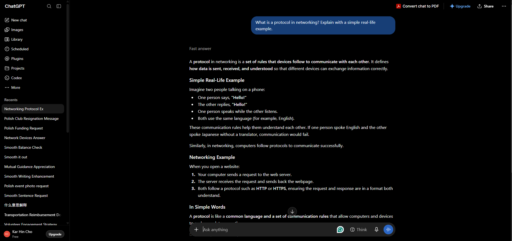
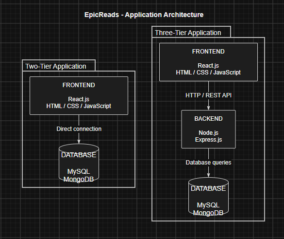
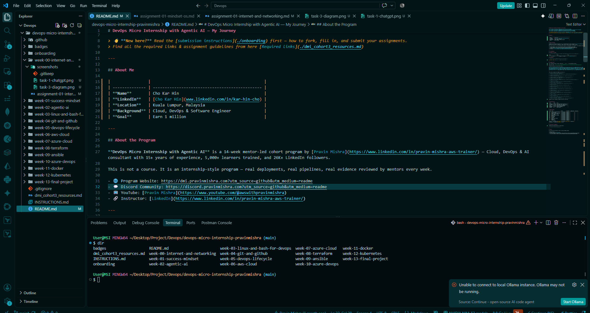

# Week 00 - Internet and Networking

Part of the DevOps Micro Internship (DMI) Cohort 3 with Agentic AI

---

# 🧑‍💻 Task 1: Using ChatGPT as Your Learning Assistant

## Scenario

You're new to DevOps and will frequently encounter technical questions. ChatGPT can be your learning companion.

## Your Task

Write a clear ChatGPT prompt to help you understand:

> "What is a protocol in networking? Explain with a simple real-life example."

Take a screenshot of your interaction showing:

- Your detailed prompt (with clear expectations)
- ChatGPT's simplified response with an example

## Screenshot

Save your screenshot in the `screenshots` folder and update the file name below.



Replace `task-1-chatgpt.png` with your actual screenshot file name.

---

## What I Learned (2–3 lines)

A protocol is a set of rules and standards that govern how data is transmitted and received between devices in a network. It ensures reliable and accurate communication.

---

# 🌐 Task 2: Internet and Networking

## Scenario

Your friend is launching an online bookstore named **EpicReads**.

He asked you to explain how users globally can access his website hosted in Finland.

## Your Task

Write a short explanation (**100–150 words**) that includes:

- Packet Switching
- IP Address
- TCP/IP
- HTTP/HTTPS

💡 **Tip:** You may use ChatGPT (as demonstrated in Task 1) to refine your explanation.

## Answer

**EpicReads** is a website hosted on a server in Finland, but users from around the world can access it through the Internet. When a user enters the website address, the **IP address** helps identify the destination server where EpicReads is hosted. The data is divided into small pieces called packets and sent across different networks using **packet switching**. Each packet may take a different route before reaching the server in Finland, where they are reassembled into the original data.

The **TCP/IP** protocol suite manages communication between the user's device and the EpicReads server. IP handles addressing and routing, while TCP ensures that packets are delivered correctly and in the right order. Finally, **HTTP/HTTPS** allows the user's browser and the web server to exchange webpage data. HTTPS also encrypts the communication, helping protect users' information.

---

# 🏗️ Task 3: Application Architecture & Stack

## Scenario

EpicReads bookstore has two application versions:

### Two-Tier Application

- Frontend
- Database

### Three-Tier Application

- Frontend
- Backend
- Database

## Your Task

- Draw simple diagrams (hand-drawn or tool-based such as draw.io)
- Label each layer clearly
- List at least two common technologies or tools used for each layer
- Submit a screenshot or photo clearly showing your own drawing

## Diagram Screenshot / Photo

Save your diagram image in the `screenshots` folder and update the file name below.



Replace `task-3-diagram.png` with your actual diagram file name.

---

## Technologies Used

### Frontend

React.js
HTML/CSS/JavaScript

### Backend

Node.js
Express.js

### Database

MySQL
MongoDB

---

# 🌍 Task 4: Domain Name & DNS (Basic Concepts)

## Scenario

Your friend's bookstore **EpicReads** is currently accessible through:

```text
52.172.142.222:3000
```

He purchased the domain:

```text
epicreads.com
```

## Your Task

In **50–100 words**, explain in your own words:

1. What is DNS (Domain Name System)?
2. Which DNS record type should be used to connect the domain to the given IP, and why?

## Answer

**DNS (Domain Name System)** is a system that translates easy-to-remember domain names, such as **epicreads.com**, into IP addresses that computers use to locate servers on the Internet. It works like a phonebook for the Internet.

For EpicReads, an **A record** should be used to connect **epicreads.com** to the IPv4 address **52.172.142.222**. The A record maps a domain name directly to an IPv4 address, allowing users to access the website using **epicreads.com** instead of remembering the numerical IP address.

---

# 💻 Task 5: Visual Studio Code Setup (Hands-on)

## Your Task

Install Visual Studio Code (if not already installed).

Take a screenshot of your VS Code environment showing:

- Terminal open inside VS Code
- Running a basic command:

### Windows

```powershell
dir
```

### Linux / macOS

```bash
pwd
ls
```

- Your selected VS Code theme clearly visible

⚠️ **Important:** The screenshot must show your username or another identifiable detail to confirm it is your environment.

## Screenshot

Save your screenshot in the `screenshots` folder and update the file name below.



Replace `task-5-vscode.png` with your actual screenshot file name.

---

# 🔗 Task 6: Publish Your Assignment as a LinkedIn Post

## Objective

Publishing on LinkedIn helps you:

- Build your professional online presence
- Reinforce your learning
- Document your DevOps journey publicly

## Your Task

Summarize your answers from Tasks 1–5 into a LinkedIn post.

Clearly structure your post into the following sections:

- ChatGPT
- Internet & Networking
- App Architecture
- DNS
- VS Code Setup

Add the following credit note at the end of your post:

> **P.S. This post is part of the DevOps Micro Internship (DMI) with Agentic AI — Cohort 3 — by Pravin Mishra. My graded progress is public: https://dmi.pravinmishra.com/s/YOUR-GITHUB-USERNAME.html · Start your DevOps journey: https://dmi.pravinmishra.com/?utm_source=student&utm_medium=ps-linkedin&utm_campaign=cohort3**

---

## LinkedIn Post URL

Paste your LinkedIn post URL here:

```text
https://lnkd.in/p/gsyRz-Xx
```

---

## LinkedIn Post Backup Copy

Paste the full text of your LinkedIn post here:

Add your post content here...
My DevOps Learning Journey — DMI Cohort 3
I’ve been learning the fundamentals of DevOps through the DevOps Micro Internship (DMI) — Cohort 3, exploring how applications communicate, are structured, and are deployed.
ChatGPT
Learned how AI tools like ChatGPT can help with learning, problem-solving, and understanding technical concepts more effectively.
Internet & Networking
Learned how the Internet enables global communication through packet switching, IP addresses, TCP/IP, and HTTP/HTTPS. I also learned how networking protocols allow devices to communicate reliably.
App Architecture
Explored the difference between two-tier and three-tier architecture:
Two-tier: Frontend → Database
Three-tier: Frontend → Backend → Database
The three-tier approach provides better separation of responsibilities and makes applications easier to maintain and scale.
DNS
Learned how DNS (Domain Name System) translates human-friendly domain names into IP addresses. For example, an A record can connect epicreads.com to an IPv4 address.
VS Code Setup
Set up my development environment using Visual Studio Code, preparing the workspace for writing, managing, and testing code throughout the internship.
This experience has helped me strengthen my understanding of how different components work together behind modern web applications. Looking forward to learning more and continuing my DevOps journey! 🚀

P.S. This post is part of the DevOps Micro Internship (DMI) with Agentic AI — Cohort 3 — by Pravin Mishra. My graded progress is public: https://lnkd.in/gVf4nieq · Start your DevOps journey: https://lnkd.in/g3D8hZKf

https://lnkd.in/gaj_DXKp

Pravin Mishra
Anjana Muthunayake

---

# Reflection – Week 0

### What did you find easy?

I found the basic networking concepts and application architecture relatively easy to understand. The examples provided made it easier for me to understand how different components work together. I was also comfortable setting up my development environment using VS Code.

---

### What was difficult?

Understanding DNS and how domain names are connected to IP addresses was slightly difficult at first. I also needed some time to understand the differences between two-tier and three-tier architecture and how data flows between each layer.

---

### What will you improve next week?

Next week, I want to improve my understanding of DevOps concepts and workflows. I also want to gain more hands-on experience with DevOps tools and practise applying the concepts I have learned instead of only understanding them theoretically.

---

## 📌 About DMI & CloudAdvisory

DevOps Micro Internship (DMI) is a project-based DevOps program run by Pravin Mishra (The CloudAdvisory) focused on real-world execution, systems thinking, and career readiness.

It helps learners build strong DevOps foundations with hands-on experience.

## 📌 Resources

- 🌐 **DMI Official Website:** https://dmi.pravinmishra.com?utm_source=github&utm_medium=readme
- 🎓 **University:** https://university.pravinmishra.com?utm_source=github&utm_medium=readme
- 💬 **Discord Community:** https://discord.pravinmishra.com?utm_source=github&utm_medium=readme
- 📝 **Blog:** https://dmi.pravinmishra.com/blog?utm_source=github&utm_medium=readme
- ▶️ **YouTube Playlist (DMI Cohort 3):** https://www.youtube.com/playlist?list=PLFeSNDtI4Cho
- 🔗 **Pravin Mishra (LinkedIn):** https://www.linkedin.com/in/pravin-mishra-aws-trainer/
- 🏢 **CloudAdvisory (LinkedIn):** https://www.linkedin.com/company/thecloudadvisory/

---

_This submission is part of DevOps Micro Internship (DMI) Cohort 3 — Agentic AI Track_
