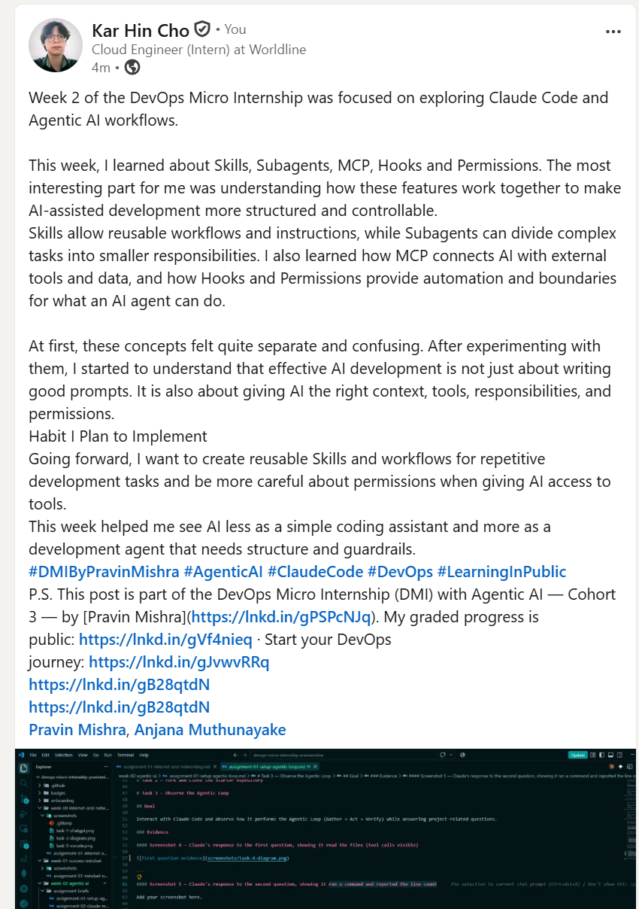

# Assignment 8 — Week 2 Reflection Blog

Part of the DevOps Micro Internship (DMI) Cohort 3 with Agentic AI

---

# Purpose

In this assignment, you will reflect on your Week 2 learning journey and write a short blog capturing your experience working with Agentic AI tools such as Claude Code, Skills, Subagents, MCP, Hooks, Permissions, and Memory.

You will also publish a LinkedIn post summarizing your learning and share both links for evaluation.

---

# Task 1 — Write Your Reflection Blog

## Goal

Write a reflection blog covering your Week 2 learning experience.

### Blog Requirements

Your blog must include:

- Title: **Reflection – Week 2**
- Minimum 300 words
- At least 2–3 topics from Week 2 (Claude Code, Skills, Subagents, MCP, Hooks, Permissions, Memory)
- Honest personal reflection (learning, challenges, mindset)
- One habit/system you plan to implement
- Your full name clearly visible

### Allowed Platforms

You can publish your blog on:

- Hashnode
- Medium
- Dev.to
- LinkedIn Article
- GitHub Markdown file
- Substack

---

### Evidence

#### Screenshot 1 — Blog published and visible


---

### Submission Field

Blog Link:

`https://medium.com/@chokarhin/reflection-week-2-97a0a18c4cbc`

---

# Task 2 — Create LinkedIn Post

## Goal

Share your Week 2 learning publicly on LinkedIn.

---

### LinkedIn Post Requirements

Your post must include:

- One screenshot from any Week 2 assignment
- Short reflection (what you learned or built)
- Required P.S. line exactly as given below

---

### Required P.S. Line (Must Include Exactly)

> **P.S. This post is part of the DevOps Micro Internship (DMI) with Agentic AI — Cohort 3 — by [Pravin Mishra](https://www.linkedin.com/in/pravin-mishra-aws-trainer/). My graded progress is public: https://dmi.pravinmishra.com/s/YOUR-GITHUB-USERNAME.html · Start your DevOps journey: https://dmi.pravinmishra.com/?utm_source=student&utm_medium=ps-linkedin&utm_campaign=cohort3**

---

### Suggested Hashtags

#DMIByPravinMishra #AgenticAI #ClaudeCode #DevOps #LearningInPublic

---

### Evidence

#### Screenshot 2 — LinkedIn post published



---

### Submission Field

LinkedIn Post Content (copy-paste here):

```
Week 2 of the DevOps Micro Internship was focused on exploring Claude Code and Agentic AI workflows.

This week, I learned about Skills, Subagents, MCP, Hooks and Permissions. The most interesting part for me was understanding how these features work together to make AI-assisted development more structured and controllable.
Skills allow reusable workflows and instructions, while Subagents can divide complex tasks into smaller responsibilities. I also learned how MCP connects AI with external tools and data, and how Hooks and Permissions provide automation and boundaries for what an AI agent can do.

At first, these concepts felt quite separate and confusing. After experimenting with them, I started to understand that effective AI development is not just about writing good prompts. It is also about giving AI the right context, tools, responsibilities, and permissions.
Habit I Plan to Implement
Going forward, I want to create reusable Skills and workflows for repetitive development tasks and be more careful about permissions when giving AI access to tools.
This week helped me see AI less as a simple coding assistant and more as a development agent that needs structure and guardrails.
#DMIByPravinMishra #AgenticAI #ClaudeCode #DevOps #LearningInPublic
P.S. This post is part of the DevOps Micro Internship (DMI) with Agentic AI — Cohort 3 — by [Pravin Mishra](https://lnkd.in/gPSPcNJq). My graded progress is public: https://lnkd.in/gVf4nieq · Start your DevOps journey: https://lnkd.in/gJvwvRRq
https://lnkd.in/gB28qtdN
https://lnkd.in/gB28qtdN
Pravin Mishra, Anjana Muthunayake
```

---

### LinkedIn Post Link:

`https://www.linkedin.com/feed/update/urn:li:share:7503814774439239680/`

---

# Submission Instructions

- Blog must be publicly accessible
- LinkedIn post must be visible (public or unlisted where applicable)
- All required fields must be filled
- Screenshot proofs must be added to GitHub repository
- Do not include sensitive information in blog or post

---

# Completion Checklist

- [ ] Blog written with required structure
- [ ] Blog includes at least 2–3 Week 2 topics
- [ ] Blog is publicly accessible
- [ ] LinkedIn post created
- [ ] Required P.S. line included
- [ ] LinkedIn post content copied in submission field
- [ ] Blog link added
- [ ] LinkedIn post link added
- [ ] Screenshots added to GitHub repo

---

# About DMI & CloudAdvisory

DevOps Micro Internship (DMI) is a project-based DevOps program run by Pravin Mishra (The CloudAdvisory), focused on real-world execution, systems thinking, and agentic AI workflows.

It helps learners build strong DevOps foundations through hands-on experience.

---

# Resources

- 🌐 DMI Official Website: [https://dmi.pravinmishra.com?utm_source=github&utm_medium=readme](https://dmi.pravinmishra.com?utm_source=github&utm_medium=readme)
- 🎓 University: [https://university.pravinmishra.com?utm_source=github&utm_medium=readme](https://university.pravinmishra.com?utm_source=github&utm_medium=readme)
- 💬 Discord Community: [https://discord.pravinmishra.com?utm_source=github&utm_medium=readme](https://discord.pravinmishra.com?utm_source=github&utm_medium=readme)
- 📝 Blog: [https://dmi.pravinmishra.com/blog?utm_source=github&utm_medium=readme](https://dmi.pravinmishra.com/blog?utm_source=github&utm_medium=readme)
- ▶️ YouTube Playlist: [https://www.youtube.com/playlist?list=PLFeSNDtI4Cho](https://www.youtube.com/playlist?list=PLFeSNDtI4Cho)
- 🔗 Pravin Mishra (LinkedIn): [https://www.linkedin.com/in/pravin-mishra-aws-trainer/](https://www.linkedin.com/in/pravin-mishra-aws-trainer/)
- 🏢 CloudAdvisory (LinkedIn): [https://www.linkedin.com/company/thecloudadvisory/](https://www.linkedin.com/company/thecloudadvisory/)
