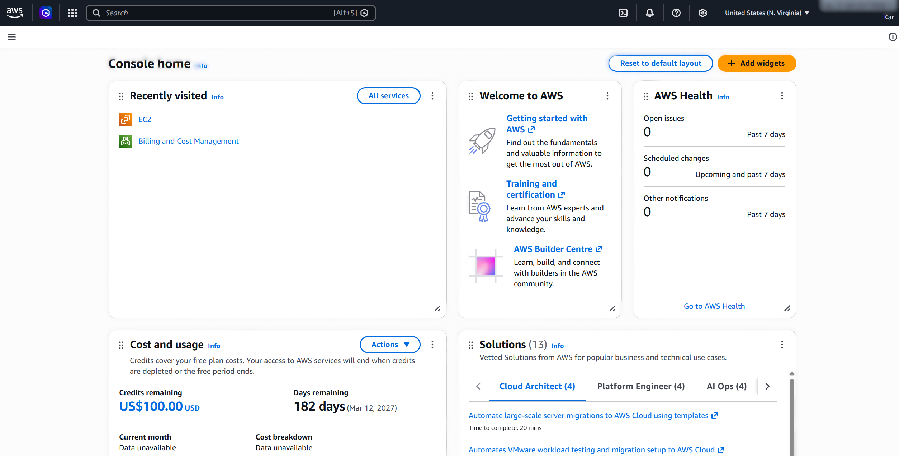

# Assignment 1 — AWS Free Tier Account Setup (EpicReads Cloud Onboarding)

Part of the DevOps Micro Internship (DMI) Cohort 3 with Agentic AI

---

## Purpose

In this assignment, you will create and verify an AWS Free Tier account as part of onboarding EpicReads — an online bookstore moving to the cloud. You will demonstrate an understanding of AWS fundamentals, Free Tier services, and account setup by answering conceptual questions and capturing proof of a working AWS Console login.

---

# Task 1 — Understanding AWS & Free Tier

## Goal

Demonstrate understanding of AWS basics and Free Tier usage by answering the following questions in your own words (3–4 lines each).

### Answers

#### Question 1 — What is an AWS account, and why do you need it at this stage?

An AWS account is a secure, isolated container within Amazon Web Services that provides administrative ownership, identity management, and resource billing boundaries. At this initial stage of onboarding EpicReads to the cloud, having an AWS account is required to gain programmatic and console access to provision foundational infrastructure—such as storage buckets, CDNs, and IAM roles—needed to host the application.

---

#### Question 2 — What is AWS Free Tier, and how long does it last?

AWS Free Tier is a program providing hands-on access to cloud services without incurring costs, structured into three distinct offer tiers: 12-Month Free, Always Free, and Short-Term Trials. The 12-Month Free Tier lasts exactly one year from the date of account registration for new customers, while Always Free tier services remain accessible without charges indefinitely as long as usage remains within specified monthly thresholds.

---

#### Question 3 — Name three AWS Free Tier services and their free usage limits.

Amazon S3 (Simple Storage Service): 5 GB of standard object storage, 20,000 GET requests, and 2,000 PUT requests per month during the 12-month free tier.

Amazon CloudFront: Always Free allocation offering 1 TB of outbound data transfer and 10,000,000 HTTP or HTTPS requests per month.

Amazon EC2 (Elastic Compute Cloud): 750 hours per month of t2.micro or t3.micro Linux/Windows instance runtime during the first 12 months.

---

# Task 2 — Create AWS Free Tier Account

## Goal

Create a valid AWS Free Tier account and sign in to the AWS Management Console.

> No screenshots required for this task. Completion is verified through Task 3.

---

# Task 3 — Verify AWS Account

## Goal

Confirm that your AWS account setup is complete by navigating to the Account section and capturing proof.

### Evidence

#### Screenshot 1 — AWS Account page showing account name (email may be blurred)

---

# Submission Instructions

- Add all required screenshots in your GitHub repository submission
- Full name must be visible in required screenshots
- Do not expose sensitive information (keys, passwords, account IDs)

---

# Completion Checklist

- [ ] Task 1 answers written in own words
- [ ] AWS Free Tier account created successfully
- [ ] Signed in to AWS Management Console
- [ ] Screenshot of AWS Account page captured (full name visible, no sensitive data)
- [ ] All required screenshots added to repository

---

## 📌 About DMI & CloudAdvisory

DevOps Micro Internship (DMI) is a project-based DevOps program run by Pravin Mishra (The CloudAdvisory) focused on real-world execution, systems thinking, and career readiness.

It helps learners build strong DevOps foundations with hands-on experience.

---

## 📌 Resources

- 🌐 DMI Official Website: https://dmi.pravinmishra.com?utm_source=github&utm_medium=readme
- 🎓 University: https://university.pravinmishra.com?utm_source=github&utm_medium=readme
- 💬 Discord Community: https://discord.pravinmishra.com?utm_source=github&utm_medium=readme
- 📝 Blog: https://dmi.pravinmishra.com/blog?utm_source=github&utm_medium=readme
- ▶️ YouTube Playlist: https://www.youtube.com/playlist?list=PLFeSNDtI4Cho
- 🔗 Pravin Mishra (LinkedIn): https://www.linkedin.com/in/pravin-mishra-aws-trainer/
- 🏢 CloudAdvisory (LinkedIn): https://www.linkedin.com/company/thecloudadvisory/

---

_This submission is part of DevOps Micro Internship (DMI) Cohort 3 — Agentic AI Track._
