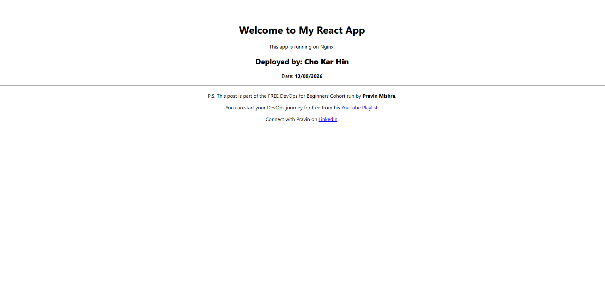

# Assignment 5 — Bash Script Automation Drill (OPS Checklist)

Part of the DevOps Micro Internship (DMI) Cohort 3 with Agentic AI

---

## Purpose

In this assignment, you will practice Bash scripting by building a series of small automation scripts covering environment setup, variables, arrays, loops, file conditionals, if-else logic, and functions. These scripts form the foundation of real-world Linux automation used in DevOps, cloud, and production support environments.

---

# Task 1 — Bash Environment & Workspace Setup

## Goal

Verify that Bash is available on your system and create a clean workspace for this assignment.

### Evidence

#### Screenshot 1 — Output of `echo $SHELL` and `bash --version`

---

#### Screenshot 2 — Output of `pwd` and `ls -lah` showing the scripts directory

---

### Notes

Answer the following in your own words:

**1. What is Bash?**

Bash (Bourne Again SHell) is an open-source Unix command-line shell and command language interpreter developed for the GNU Project. It serves as both an interactive user interface for executing system commands and a procedural programming environment for automating administrative tasks, managing processes, and manipulating files.

---

**2. What is the difference between shell and Bash?**

A shell is a generic term for any command-line interface program that reads user input and translates it into instructions for the operating system kernel (e.g., sh, dash, ksh, csh, zsh, bash). Bash is a specific, feature-rich implementation of a shell that builds upon the POSIX-standard Bourne shell (sh) by adding interactive features (such as tab completion, command history) and advanced scripting capabilities (such as arrays, built-in arithmetic, and extended conditional expressions [[]]).

---

**3. Why is it important to confirm the Bash version before writing scripts?**

Confirming the Bash version is essential because modern scripting features vary across major releases:
Compatibility & Syntax: Features like associative arrays were introduced in Bash 4.0, while case modification syntax (${var^^}) and parameter transformation (${var@Q}) require newer releases.
Cross-Platform Portability: Older legacy environments (such as default macOS terminals which remain on Bash 3.2 due to licensing) or minimal Alpine Linux container images (which use ash/BusyBox) fail when encountering scripts that rely on Bash 4+ or 5+ features. Checking the version upfront prevents syntax errors and runtime failures across target deployment environments.

---

# Task 2 — Your First Bash Script

## Goal

Create your first Bash script, make it executable, and run it from the terminal.

### Evidence

#### Screenshot 1 — Content of `first-script.sh`

---

#### Screenshot 2 — Output of `./first-script.sh`

---

#### Screenshot 3 — Output of `ls -l first-script.sh` showing executable permission

---

### Notes

Answer the following in your own words:

**1. What is the purpose of `#!/bin/bash`?**

Known as the shebang (or hashbang), #!/bin/bash is a two-byte magic number (0x23 0x21) read by the Linux kernel's execve system call. It specifies the absolute path of the interpreter binary that must be spawned to parse and execute the subsequent lines of the file. Without it, the operating system defaults to the system's fallback shell (typically /bin/sh or dash on Debian/Ubuntu), which can cause syntax errors if the script contains Bash-specific language features.

---

**2. Why do we use `chmod +x` before running a script?**

Newly created files in Linux inherit default file creation mask (umask) permissions (typically 644 or -rw-r--r--), which allow read and write access but deliberately lack execute rights. Running chmod +x sets the execution bit (x) across the permission bits. Without this bit enabled, the Linux kernel security model blocks the operating system from loading the file into memory as an executable binary, returning a Permission denied error.

---

**3. What is the difference between running a script using `./script.sh` and `bash script.sh`?**

./script.sh: Treats the script as a standalone executable program. The Linux kernel reads the shebang line (#!/bin/bash) to determine the interpreter and requires that the file has explicit execute permissions (chmod +x).
bash script.sh: Directly invokes the bash executable binary and passes the file as a plain text argument for parsing. Because the bash program itself already has execute permissions, this method executes the script even if the script file lacks +x permissions, and it ignores whatever interpreter is defined in the shebang line.

---

# Task 3 — Variables: User Information Script

## Goal

Use variables to store and display user-related information.

### Evidence

#### Screenshot 1 — Content of `user-info.sh`

---

#### Screenshot 2 — Output of `./user-info.sh`

---

### Notes

Answer the following in your own words:

**1. What is a variable in Bash?**

A variable in Bash is a named container in memory used to store data, such as text strings, integers, paths, or the output of subcommands. Variables hold runtime state that can be referenced, modified, or interpolated across commands throughout the execution lifecycle of a script.

---

**2. Why should we avoid spaces around the `=` sign when creating variables?**

In Bash, whitespace is not merely visual formatting—it is the syntax delimiter used by the command parser to separate command names from their arguments.
If you write NAME = value, Bash interprets NAME as an executable command, with = and value as separate arguments, resulting in a command not found error.
If you write NAME= value, Bash treats NAME= as a temporary environment variable assignment for an empty command named value.
Therefore, variable assignment must strictly follow the VARIABLE=value syntax with no surrounding spaces so the parser recognizes it as an assignment operation.

---

**3. How do you access the value stored inside a Bash variable?**

You access the value stored in a variable by prefixing the variable name with the dollar sign symbol ($), such as $FULL_NAME. For safer scripting and unambiguous variable expansion (especially when concatenating with surrounding text or working with arrays), parameter expansion using curly braces ${FULL_NAME} is the standard industry best practice.

---

# Task 4 — Arrays & Loops: Tools Checklist Script

## Goal

Use arrays and loops to print a checklist of tools used in Bash scripting.

### Evidence

#### Screenshot 1 — Content of `tools-checklist.sh`

---

#### Screenshot 2 — Output of `./tools-checklist.sh`

---

### Notes

Answer the following in your own words:

**1. What is an array in Bash?**

An array in Bash is a zero-indexed data structure that stores multiple distinct values under a single variable name. Elements are ordered and can be accessed individually using index notation (such as ${tools[0]}) or collectively as an entire list.

---

**2. Why are arrays useful in scripts?**

Arrays allow scripts to organize, group, and process collections of related data—such as package names, IP addresses, service names, or deployment files—without needing to declare dozens of individual variables. They enable clean batch operations and make code maintainable and dry (Don't Repeat Yourself).

---

**3. What does `"${tools[@]}"` mean?**

"${tools[@]}" expands the entire array into individual, properly quoted positional elements. The double quotes combined with the @ symbol guarantee that elements containing spaces or special characters are preserved as distinct items without undergoing unintended word-splitting or globbing by the shell. (Using ${#tools[@]} also gives the total count/length of elements in the array).

---

**4. What is the purpose of the `for` loop in this script?**

The for loop iterates sequentially through each item provided by the expanded array "${tools[@]}". During each cycle of the loop, it temporarily assigns the current item to the loop variable tool, executes the code block (printing the formatted checklist entry and incrementing the counter), and terminates automatically when all elements have been evaluated.

---

# Task 5 — Loops: Number Counter Script

## Goal

Use loops to repeat a task multiple times.

### Evidence

#### Screenshot 1 — Content of `counter.sh`

---

#### Screenshot 2 — Output of `./counter.sh`

---

### Notes

Answer the following in your own words:

**1. What is a loop?**

A loop is a programming control structure that repeatedly executes a block of statements as long as a specified condition remains true or until all items in a defined collection/sequence have been processed.

---

**2. Why do we use loops in Bash scripting?**

Loops eliminate redundant manual code execution and human intervention. In DevOps scripting, loops automate repetitive operational workflows—such as retrying failed health checks, pinging endpoints until they become healthy, rotating log files, or provisioning multiple server instances across clusters.

---

**3. How many times did the loop run in your script?**

The loop ran exactly 5 times, incrementing from 1 through 5.

---

**4. What would you change if you wanted the loop to run 10 times?**

To run the loop 10 times, you would update the boundary variable from END=5 to END=10 (or write for count in {1..10} / for ((i=1; i<=10; i++))).

---

# Task 6 — Files & Conditionals: File Validation Script

## Goal

Use file checks and conditionals to verify whether files and directories exist.

### Evidence

#### Screenshot 1 — Output of `ls -lah ../test-folder`

---

#### Screenshot 2 — Content of `file-check.sh`

---

#### Screenshot 3 — Output of `./file-check.sh`

---

### Notes

Answer the following in your own words:

**1. What does `-d` check in Bash?**

In Bash, the -d file test operator checks whether a specified path exists and is specifically a directory. If the directory exists, the conditional evaluates to true (exit status 0); if the path does not exist or points to a regular file/symlink, it evaluates to false (non-zero exit status).

---

**2. What does `-f` check in Bash?**

The -f file test operator checks whether a specified path exists and is a regular file (as opposed to a directory, socket, named pipe, or device file). It evaluates to true only if the target is an existing regular file.

---

**3. Why should file and directory paths be stored in variables?**

Storing file and directory paths in variables provides three key advantages:
Single Source of Truth: If a path or mount point changes, you update it once at the top of the script rather than searching and replacing it throughout dozens of commands.
Reduces Typo Risks: Eliminates copy-paste errors or path discrepancies across commands.
Code Readability & Maintainability: Makes the script modular and parameterized, allowing paths to be dynamically passed as environment variables or arguments when moving between dev, staging, and production environments.

---

**4. What happens if the file does not exist?**

When a file does not exist, the [ -f "$PATH" ] condition evaluates to false. The execution pointer immediately skips the then block and jumps to the else block (or continues down the script if no else exists). This allows the script to handle missing files gracefully—such as logging an alert, initializing a default file, or exiting cleanly with an informative error code—rather than allowing downstream commands to crash with unexpected "No such file or directory" exceptions.

---

# Task 7 — Conditionals: Pass or Retry Script

## Goal

Use if-else conditionals to make decisions based on a variable value.

### Evidence

#### Screenshot 1 — Content of `score-check.sh` with `score=85`

---

#### Screenshot 2 — Output showing `Result: Pass`

---

#### Screenshot 3 — Content of `score-check.sh` with `score=55`

---

#### Screenshot 4 — Output showing `Result: Retry`

---

### Notes

Answer the following in your own words:

**1. What is the purpose of if-else in Bash?**

The purpose of an if-else construct in Bash is to implement conditional branching and decision-making logic. It allows a script to execute a specific block of commands if a test condition evaluates to true (exit code 0), or an alternative fallback block (else) if the condition evaluates to false (non-zero exit code).

---

**2. What does `-ge` mean?**

In Bash test expressions, -ge stands for "greater than or equal to" (>=). It is an integer comparison operator used to evaluate whether the numeric value on the left side is numerically greater than or equal to the numeric value on the right side.

---

**3. Why should conditions be tested with different values?**

Testing conditions with multiple values (both valid/passing cases and invalid/failing boundary cases) ensures comprehensive test coverage. It proves that the boolean logic correctly diverges into both execution branches as designed and confirms that no edge conditions or inverted logic slip into automated production jobs.

---

**4. How can conditionals help in automation scripts?**

Conditionals turn static sequential scripts into intelligent, self-healing automation tools:
Threshold Alerting: Checking if server disk usage or RAM saturation crosses a safety limit and firing alerts.
Error Handling & Idempotency: Checking whether a service or package is already installed/running before executing an install command.
Deployment Validation: Checking if an endpoint returns HTTP status 200 before cutting live user traffic over to a newly deployed release.

---

# Task 8 — Functions: Final Bash Automation Script

## Goal

Create a final Bash script using functions to organize reusable code.

### Evidence

#### Screenshot 1 — Content of `final-automation.sh`

---

#### Screenshot 2 — Output of `./final-automation.sh`

---

#### Screenshot 3 — Output of `ls -lah` showing all created scripts

---

### Notes

Answer the following in your own words:

**1. What is a function in Bash?**

A function in Bash is a named, modular block of code designed to perform a dedicated sub-task. It can be invoked repeatedly anywhere within the script simply by calling its name, supporting localized variables, parameters ($1, $2), and return exit codes.

---

**2. Why are functions useful in scripts?**

Functions provide three major operational benefits:
Code Reusability & DRY (Don't Repeat Yourself): Eliminates redundant duplicate commands across the codebase.
Modularity & Maintenance: Divides complex workflows into manageable, testable units, making debugging significantly faster during production outages.
Readability & Clean Orchestration: Enables high-level execution pipelines through a clean main entrypoint function, allowing any engineer to scan the script structure and understand the operational workflow immediately.

---

**3. Which functions did you create in this script?**

In final-automation.sh, four primary functions and one orchestrator were created:
display_header(): Retrieves and prints execution metadata (hostname, active user, timestamp).
check_filesystem(): Validates that the target directory and required configuration file exist on disk.
audit_services(): Iterates through the list of critical service daemons using an array and for loop.
evaluate_readiness(): Assesses overall system score against baseline requirements using integer conditionals.
main(): Orchestrates the structured execution flow from start to finish.

---

**4. How does this final script combine variables, arrays, loops, conditionals, files, and functions?**

The final script synthesizes all fundamental Bash concepts into an integrated health check suite
Variables: Stores global directory paths (APP_DIR), threshold values (MIN_THRESHOLD), and scores (PASS_SCORE).
Arrays: Defines a collection of target services (SERVICES=("nginx" "ssh" "cron")).
Loops: Iterates over the array items via a for service in "${SERVICES[@]}" loop to process each item sequentially.
Files & Paths: Inspects directory and regular file presence using the -d and -f test operators.
Conditionals: Evaluates whether paths exist and checks whether the score meets pass criteria using if-else and -ge.
Functions: Encapsulates each distinct phase into modular routines orchestrated through a top-level main function.

---

# LinkedIn Post (Required)

## Evidence

#### LinkedIn Post URL

Paste your LinkedIn post URL here:

`https://www.linkedin.com/feed/update/urn:li:share:7503814774439239680/`

---

#### Screenshot — Published LinkedIn post

---

# Submission Instructions

- Add all required screenshots in your submission
- Full name must be visible in required screenshots
- All script files must be created and run successfully
- Required notes must be answered clearly for every task
- Do not expose sensitive information (keys, passwords, credentials)

---

# Completion Checklist

- [ ] Task 1: Environment setup verified, workspace created (Screenshots 1–2, Notes answered)
- [ ] Task 2: First script created, executed, permissions verified (Screenshots 1–3, Notes answered)
- [ ] Task 3: Variables script created and run (Screenshots 1–2, Notes answered)
- [ ] Task 4: Arrays and loops script created and run (Screenshots 1–2, Notes answered)
- [ ] Task 5: Counter loop script created and run (Screenshots 1–2, Notes answered)
- [ ] Task 6: File validation script created and run (Screenshots 1–3, Notes answered)
- [ ] Task 7: Pass/Retry conditional script tested with both values (Screenshots 1–4, Notes answered)
- [ ] Task 8: Final automation script created and run (Screenshots 1–3, Notes answered)
- [ ] All scripts run without errors
- [ ] Full Name visible in all required screenshots
- [ ] LinkedIn post published and URL submitted
- [ ] No sensitive data exposed

---

## 📌 About DMI & CloudAdvisory

DevOps Micro Internship (DMI) is a project-based DevOps program run by Pravin Mishra (The CloudAdvisory) focused on real-world execution, systems thinking, and career readiness.

It helps learners build strong DevOps foundations with hands-on experience.

---

## 📌 Resources

- 🌐 DMI Official Website: https://dmi.pravinmishra.com?utm_source=github&utm_medium=readme
- 🎓 University: https://university.pravinmishra.com?utm_source=github&utm_medium=readme
- 💬 Discord Community: https://discord.pravinmishra.com?utm_source=github&utm_medium=readme
- 📝 Blog: https://dmi.pravinmishra.com/blog?utm_source=github&utm_medium=readme
- ▶️ YouTube Playlist: https://www.youtube.com/playlist?list=PLFeSNDtI4Cho
- 🔗 Pravin Mishra (LinkedIn): https://www.linkedin.com/in/pravin-mishra-aws-trainer/
- 🏢 CloudAdvisory (LinkedIn): https://www.linkedin.com/company/thecloudadvisory/

---

_This submission is part of DevOps Micro Internship (DMI) Cohort 3 — Agentic AI Track._
