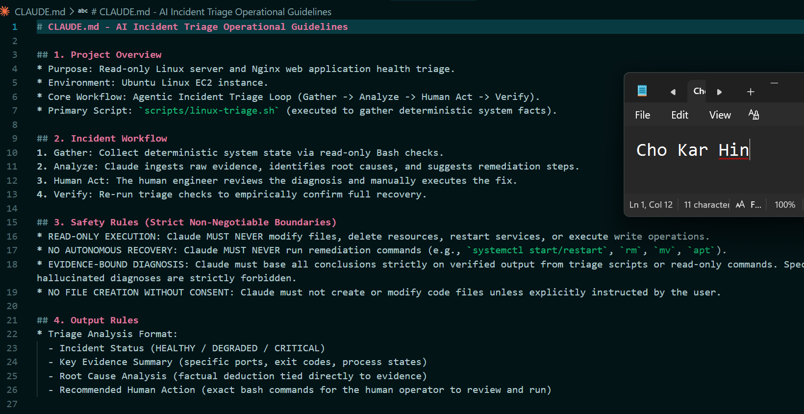
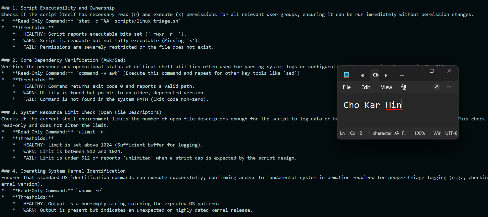
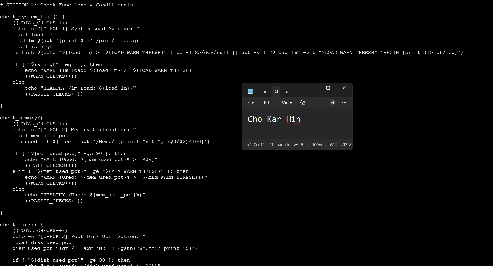
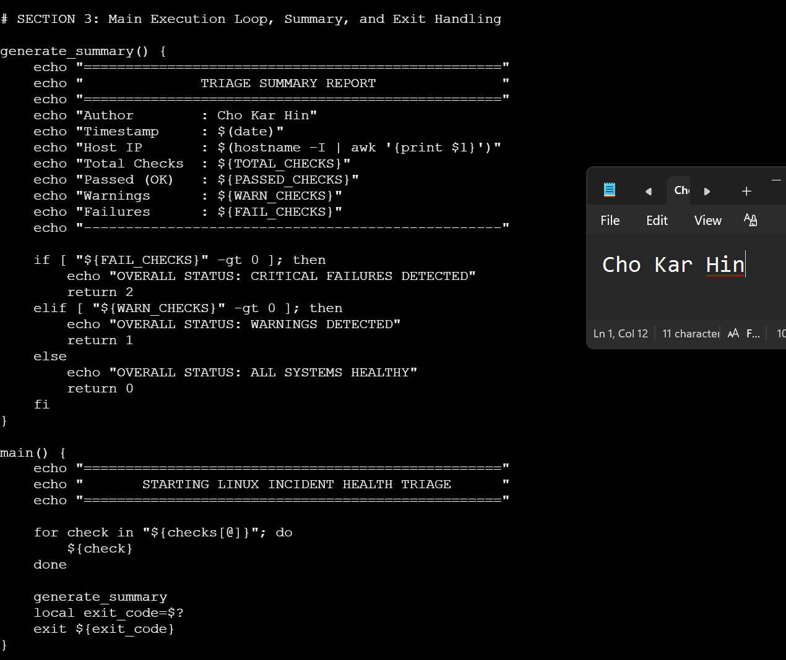
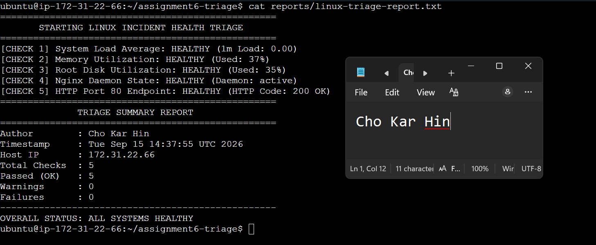
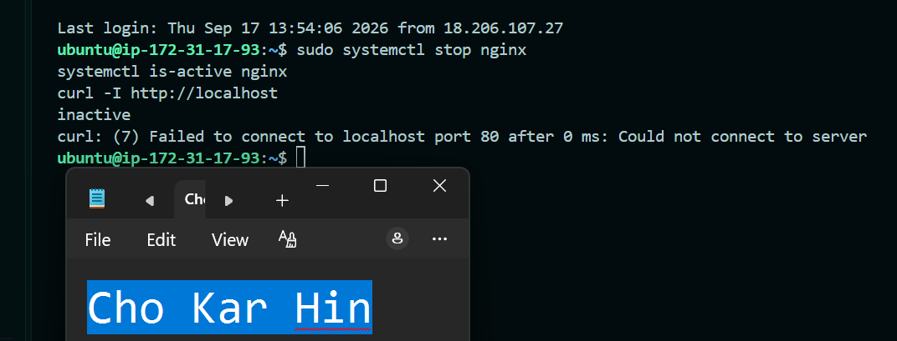
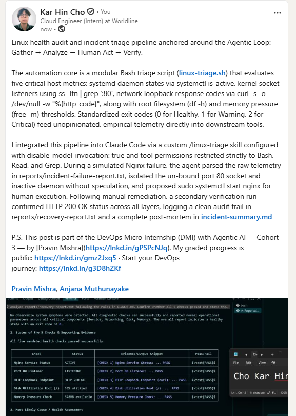

# Assignment 6 — Build an AI-Assisted Linux Health Check (AI-Assisted Linux Incident Triage)

Part of the DevOps Micro Internship (DMI) Cohort 3 with Agentic AI

---

## Purpose

In this assignment, you will build a read-only Bash triage script that checks the health of your Ubuntu server and Nginx application, connect it to Claude Code as a reusable `/linux-triage` skill, simulate a controlled Nginx incident, use the skill to gather and analyze evidence, recover the service manually, and verify recovery. The workflow follows the Agentic Loop: Gather → Analyze → Human Act → Verify.

---

# Task 1 — Confirm the Healthy Baseline and Create the Workspace

## Goal

Confirm that Nginx and the React application are healthy before building the automation.

### Evidence

#### Screenshot 1 — Output of `systemctl is-active nginx`, `ss -ltn | grep ':80'`, and `curl -I http://localhost`

---

#### Screenshot 2 — Output of `pwd` and `find . -maxdepth 4 -type d | sort` showing the workspace folder structure

---

### Notes

Answer the following in your own words:

**1. What proves that Nginx is running?**

The command systemctl is-active nginx returning an exit code of 0 and printing the status string active proves that the Nginx systemd service unit is initialized, has an active master process PID, and is currently running without being terminated or hung.

---

**2. What proves that the server is listening for HTTP traffic?**

The command sudo ss -ltn | grep ':80' outputting a socket in the LISTEN state bound to port 80 (e.g., 0.0.0.0:80 or \*:80) proves that the kernel TCP stack has allocated a socket and Nginx worker processes are actively listening for incoming TCP connection requests. Furthermore, curl -I http://localhost returning HTTP/1.1 200 OK proves the application layer is actively accepting connections and serving HTTP traffic.

---

**3. Why must you capture a healthy baseline before simulating an incident?**

Capturing a healthy baseline establishes an empirical ground-truth benchmark of normal system behavior (process state, port bindings, resource utilization, and HTTP response codes). Without an established baseline, it is impossible to determine whether an anomaly observed during an incident is a symptom of the new failure or merely a pre-existing condition of the environment.

---

# Task 2 — Create Project Context and Safety Rules in CLAUDE.md

## Goal

Tell Claude exactly what this project does and what it is not allowed to do.

### Evidence

#### Screenshot 3 — CLAUDE.md open in VS Code showing all four sections (Project Overview, Incident Workflow, Safety Rules, Output Rules)

---

### Notes

Answer the following in your own words:

**1. Why should Claude receive project-specific operational rules?**

General-purpose AI models are trained to be broadly helpful and will default to attempting fixes directly if not constrained. Providing project-specific operational rules in CLAUDE.md grounds the AI in the exact system architecture, enforces operational boundaries (such as strict read-only execution), prevents dangerous autonomous system mutations, and ensures that the AI adheres to the team's incident management protocol.

---

**2. Why is the human required to execute the recovery command?**

The human-in-the-loop (HITL) requirement ensures accountability, safety, and operational control. Automated tools and AI agents can misinterpret edge cases or make incomplete diagnoses. Having a human engineer review the proposed remediation guarantees that destructive, service-impacting, or unnecessary commands are never executed blindly against live infrastructure.

---

**3. Which rule prevents Claude from making an unsupported diagnosis?**

The "EVIDENCE-BOUND DIAGNOSIS" rule under Section 3 (Safety Rules) prevents unsupported diagnoses. It explicitly mandates that all conclusions, status assessments, and root cause findings must be derived strictly from verified, deterministic output captured by the read-only triage script. Speculative, hallucinated, or ungrounded assertions are forbidden.

---

# Task 3 — Use Agentic AI to Plan Before Writing the Script

## Goal

Use Claude Code to inspect the environment and produce a read-only plan before creating any Bash code.

### Evidence

#### Screenshot 4 — Claude Code showing the five-check plan and read-only inspection results

---

### Notes

Answer the following in your own words:

**1. Which part of this task represents the Gather phase?**

The read-only query phase where the system's runtime telemetry (load average, memory percentage, disk space, and Nginx port state) is captured and provided to the model without altering system state.

---

**2. Did Claude follow the instruction not to create files? How did you verify this?**

Yes. It was verified by running ls -la scripts/, which confirmed that zero files were created in the scripts directory.

---

**3. Why is planning before coding useful in DevOps automation?**

Planning establishes explicit metric definitions, failure thresholds, and output conventions before writing executable code, preventing logic errors, false alerts, or unintentional system modifications.

---

# Task 4 — Build the Linux Triage Bash Script

## Goal

Create one Bash script that gathers consistent Linux and Nginx health evidence.

### Evidence

#### Screenshot 5 — Top section of `linux-triage.sh` showing variables, thresholds, and the checks array

---

#### Screenshot 6 — Middle section showing check functions and conditionals

---

#### Screenshot 7 — Bottom section showing the loop, summary function, and exit behavior

---

#### Screenshot 8 — Output of `bash -n scripts/linux-triage.sh` (no syntax errors) and `ls -l scripts/linux-triage.sh` showing executable permission

---

### Notes

Answer the following in your own words:

**1. What is stored in the checks array?**

The checks array stores the string names of the individual modular health check functions (check_system_load, check_memory, check_disk, check_nginx_status, and check_http_endpoint).

---

**2. How does the `for` loop use that array?**

The for loop iterates sequentially through each item in "${checks[@]}". During each pass, it executes the current function dynamically by invoking its name ${check}, running every registered diagnostic test without duplicating procedural code.

---

**3. Why are the health checks separated into functions?**

Modularizing checks into functions provides three key engineering benefits:
Isolation: Each check inspects a single system subsystem, preventing failures in one probe from breaking the rest of the script.
Maintainability & Extensibility: New checks (e.g., database connectivity, SSL certificate expiration) can be added simply by defining a function and registering it in the array.
Readability: Keeps the main execution pipeline concise and decoupled from diagnostic implementation details.

---

**4. What is the purpose of `$(...)` in this script?**

`$(...)` represents command substitution. It executes a subshell command (such as awk, free, df, systemctl, or curl) and captures its standard output into a variable for arithmetic evaluation and conditional checking.

---

**5. Why does the script use different exit codes for HEALTHY, WARN, and FAIL?**

Standardizing exit codes (0 for HEALTHY, 1 for WARN, 2 for FAIL) allows external consumers—such as CI/CD deployment pipelines, systemd timers, monitoring alerts, or AI agents—to programmatically determine operational health without fragile regex parsing of console text.

---

# Task 5 — Run and Understand the Healthy-State Report

## Goal

Run the Bash script against the healthy server and verify that it creates a report.

### Evidence

#### Screenshot 9 — Output of `./scripts/linux-triage.sh` showing your Full Name and all five check results

---

#### Screenshot 10 — Output showing the captured exit code and final summary

---

### Notes

Answer the following in your own words:

**1. What is the overall status of your healthy baseline?**

The overall status is ALL SYSTEMS HEALTHY. All 5 diagnostic checks passed without warnings or failures, and the script returned an exit code of 0.

---

**2. Which exact Linux evidence proves the application is serving traffic?**

Two specific pieces of evidence prove the application is serving traffic:
Check 4: systemctl is-active nginx returns active, proving the master process and worker threads are running.
Check 5: The curl probe curl -s -o /dev/null -w "%{http_code}" http://localhost returns an HTTP status code of 200 OK, proving that the TCP socket on port 80 is listening, accepting connections, and successfully serving the web application payload.

---

**3. Did your script return exit code 0 or 1? Explain why.**

The script returned exit code 0. In the script's exit logic (generate_summary), exit code 0 is explicitly returned when both FAIL_CHECKS and WARN_CHECKS equal 0, indicating that all 5 checks passed within acceptable operational thresholds.

---

**4. What is the difference between a warning and a failure in this script?**

Warning (WARN, Exit Code 1): Indicates non-fatal resource saturation or elevated load approaching operational limits (e.g., CPU load >= 1.5, or RAM/Disk usage between 80% and 89%). The service remains operational and reachable, but requires engineer awareness.
Failure (FAIL, Exit Code 2): Indicates severe resource depletion (e.g., RAM/Disk >= 90%) or total service outage (Nginx daemon inactive/failed, or port 80 returning non-200 / connection refused). Immediate remediation is required to restore availability.

---

# Task 6 — Create and Run the /linux-triage Skill

## Goal

Turn the Bash script into a reusable, manually invoked Agentic AI workflow.

### Evidence

#### Screenshot 11 — `SKILL.md` showing the frontmatter, allowed tool restrictions, and safety rules

---

#### Screenshot 12 — `/linux-triage` output for the healthy server

---

### Notes

Answer the following in your own words:

**1. Why does this skill have Bash, Read, and Grep, but not Write?**

Restricting the skill to Bash, Read, and Grep enforces the Principle of Least Privilege. Triage is strictly an observation and analysis task. Denying Write access guarantees that the AI cannot accidentally overwrite configuration files, delete diagnostic logs, or alter application state during an investigation.

---

**2. Why is `disable-model-invocation: true` useful for this skill?**

Setting disable-model-invocation: true ensures that the AI cannot autonomously trigger this skill on its own background initiative. The skill can only be invoked through explicit, intentional human initiation (e.g., when the on-call engineer types /linux-triage), preventing unnecessary overhead or unauthorized automated scans.

---

**3. What part is performed by Bash, and what part is performed by Claude?**

Bash (linux-triage.sh): Performs the deterministic Gather phase. It executes operating system probes, computes utilization percentages, tests network sockets, and collects ground-truth telemetry.
Claude / Local AI: Performs the cognitive Analyze phase. It parses the gathered report, correlates multiple signals, identifies anomalies against baseline expectations, and structures a clear diagnostic summary for the human operator.

---

**4. Why is this better than asking Claude "Is my server healthy?" without giving it evidence?**

Without direct telemetry, an AI model has zero awareness of the runtime environment and will hallucinate generic answers, make false assumptions, or output speculative advice. Grounding the AI with empirical Bash evidence ensures its conclusions are deterministic, verifiable, and tied directly to true system state.

---

# Task 7 — Simulate an Nginx Incident and Let the Skill Diagnose It

## Goal

Create a controlled service failure, gather evidence through Bash, and let Claude analyze the evidence without taking recovery action.

### Evidence

#### Screenshot 13 — Output showing Nginx is inactive and the HTTP request fails

---

#### Screenshot 14 — `/linux-triage` output showing failed evidence, most likely cause, and a suggested recovery command

---

#### Screenshot 15 — `incident-failure-report.txt` showing the failed checks and your Full Name

---

### Notes

Answer the following in your own words:

**1. Which three checks failed?**

Check 1: Nginx Service Status — systemctl is-active returned non-zero, indicating INACTIVE.
Check 2: Port 80 Listener — ss -ltn detected no active listening TCP socket bound to port 80.
Check 3: HTTP Loopback Endpoint (curl) — curl connection was refused, returning status code 000.

---

**2. What evidence supports the conclusion that Nginx is unavailable?**

The systemd process supervisor reports the daemon state as inactive (dead).
The kernel networking stack shows no socket open on 0.0.0.0:80 or [::]:80.
The client HTTP GET request against localhost failed with curl: (7) Failed to connect to localhost port 80: Connection refused

---

**3. Did Claude execute the recovery command? Why is that important?**

No, Claude strictly adhered to the CLAUDE.md safety rules and only suggested sudo systemctl start nginx for human execution. This is critical because automatic service mutations by an AI agent can overwrite forensic state, restart services into broken configurations, or trigger cascading failures across dependent infrastructure without human verification and oversight.

---

**4. Which phase of the Agentic Loop is represented by the Bash report?**

The Gather phase. The Bash script collects empirical, read-only system telemetry (daemon states, kernel socket bindings, and network response codes) without making diagnostic assumptions.

---

**5. Which phase is represented by Claude's explanation?**

The Analyze phase. Claude parses the raw telemetry, correlates the failures across the process and network layers, diagnoses the root cause (stopped Nginx daemon), and formulates a safe remediation recommendation for the human operator.

---

# Task 8 — Recover Manually, Verify Again, and Write the Incident Summary

## Goal

Recover the service as the human operator and prove that the system is healthy again.

### Evidence

#### Screenshot 16 — Output showing Nginx is active and `curl -I http://localhost` returns 200 OK

---

#### Screenshot 17 — Second `/linux-triage` output showing successful recovery with no FAIL results

---

#### Screenshot 18 — Output of `ls -lah reports` showing both `incident-failure-report.txt` and `recovery-report.txt`

---

#### Screenshot 19 — `incident-summary.md` showing all required sections and your Full Name

---

### Notes

Answer the following in your own words:

**1. What action did you execute manually?**

Executed sudo systemctl start nginx to instruct systemd to start the Nginx master process and worker threads.

---

**2. What evidence proves that the service recovered?**

systemctl is-active nginx transitioned from inactive to active.
ss -ltn verified that port 80 resumed listening for inbound connections.
curl -I http://localhost returned an HTTP/1.1 200 OK response header.
Re-executing ./scripts/linux-triage.sh (archived in reports/recovery-report.txt) produced 5 passing checks and exited with clean status code 0.

---

**3. Why is the second triage run necessary?**

The second triage run completes the verification phase of the Agentic Loop. It provides repeatable, empirical proof that the remediation resolved the issue without causing configuration regressions, port conflicts, or secondary resource issues.

---

**4. What could go wrong if an AI agent automatically restarted every failed service?**

Destruction of Forensic Data: An immediate restart clears transient process memory, crash dumps, and unwritten buffer logs needed to uncover root causes.
Cascading Outages: If a failure stems from an overloaded database or upstream API, restarting client services can trigger a "thundering herd" effect that worsens infrastructure stability.
Infinite Crash Loops: If a service fails due to invalid configuration or corrupted binaries, automated restarts consume system resources in a continuous failure loop without resolving the problem.

---

**5. In one sentence, explain the difference between using AI as a chatbot and using AI in this agentic workflow.**

While an AI chatbot generates conversational text based on assumptions, an agentic workflow reasons over empirical system telemetry collected by deterministic tools and suggests structured, grounded actions within strict safety boundaries.

---

# Incident Summary

Fill in all seven sections below in your own words.

**Full Name:** Cho Kar Hin

**Date:** 17/09/2026

---

**1. Reported Symptom**

The web service became completely unreachable over HTTP. Client requests to http://localhost were rejected with Connection refused, resulting in an HTTP status code of 000.

---

**2. Evidence Collected**

The ./scripts/linux-triage.sh script captured three critical failures:
Check 1: Nginx Service Status reported INACTIVE (FAIL) via systemctl is-active.
Check 2: Port 80 Listener reported NOT LISTENING on Port 80 (FAIL) via ss -ltn.
Check 3: HTTP Loopback Endpoint reported HTTP FAILED [Status Code: 000] (FAIL) via curl.
Disk utilization and memory checks passed normally, ruling out storage or RAM bottlenecks.

---

**3. Most Likely Cause**

The Nginx daemon process had terminated or was stopped via systemd, leaving port 80 unbound and dropping all incoming HTTP connections.

---

**4. Human-Approved Recovery Action**

sudo systemctl start nginx

---

**5. Verification**

Manual probe: curl -I http://localhost returning HTTP/1.1 200 OK.
Automated verification: Executing ./scripts/linux-triage.sh into reports/recovery-report.txt confirmed all 5 checks passed with overall status HEALTHY (Exit 0).

---

**6. Safety Decision**

The triage skill was constrained to read-only tools (Bash, Read, Grep) with autonomous invocation disabled (disable-model-invocation: true). This design ensured the AI could only inspect and recommend, maintaining human authority over all state-changing actions.

---

**7. Agentic Loop Mapping**

Gather: Collected raw system telemetry using ./scripts/linux-triage.sh and saved it to reports/incident-failure-report.txt.
Analyze: Claude evaluated the failure report to isolate the stopped daemon and recommended the recovery command without executing it.
Human Act: The operator manually ran sudo systemctl start nginx.
Verify: Re-ran the triage script to confirm 200 OK health status and archived reports/recovery-report.txt.

---

# LinkedIn Post (Required)

## Evidence

#### LinkedIn Post URL

Paste your LinkedIn post URL here:

`https://www.linkedin.com/feed/update/urn:li:share:7506365184391692288/`

---

#### Screenshot — Published LinkedIn post

---

# GitHub Repository URL

Paste the URL of your GitHub folder or repository containing the assignment files here:

`https://github.com/JokerHin/linux-and-bash-for-devops`

---

# Submission Instructions

- Add all required screenshots in your submission
- Full Name must be visible in required screenshots and the Bash report
- All written answers must be in your own words
- Do not expose sensitive information (keys, passwords, AWS account IDs, tokens)
- GitHub URL must be included in this document

---

# Completion Checklist

- [ ] Task 1: Healthy baseline confirmed, workspace created (Screenshots 1–2, Notes answered)
- [ ] Task 2: CLAUDE.md created with all four sections (Screenshot 3, Notes answered)
- [ ] Task 3: Five-check plan produced by Claude using read-only tools (Screenshot 4, Notes answered)
- [ ] Task 4: `linux-triage.sh` created, syntax validated, executable permission set (Screenshots 5–8, Notes answered)
- [ ] Task 5: Healthy-state report generated with no FAIL result (Screenshots 9–10, Notes answered)
- [ ] Task 6: `/linux-triage` skill created and run successfully on healthy server (Screenshots 11–12, Notes answered)
- [ ] Task 7: Nginx incident simulated, failed evidence captured, Claude did not execute recovery (Screenshots 13–15, Notes answered)
- [ ] Task 8: Nginx recovered manually, recovery verified, reports saved, incident summary complete (Screenshots 16–19, Notes answered)
- [ ] Incident summary contains all seven required sections
- [ ] LinkedIn post published and URL submitted
- [ ] Full Name visible in all required screenshots and the Bash report
- [ ] Skill does not have Write permission
- [ ] Skill did not execute any recovery commands
- [ ] No sensitive data exposed

---

## 📌 About DMI & CloudAdvisory

DevOps Micro Internship (DMI) is a project-based DevOps program run by Pravin Mishra (The CloudAdvisory) focused on real-world execution, systems thinking, and career readiness.

It helps learners build strong DevOps foundations with hands-on experience.

---

## 📌 Resources

- 🌐 DMI Official Website: https://dmi.pravinmishra.com?utm_source=github&utm_medium=readme
- 🎓 University: https://university.pravinmishra.com?utm_source=github&utm_medium=readme
- 💬 Discord Community: https://discord.pravinmishra.com?utm_source=github&utm_medium=readme
- 📝 Blog: https://dmi.pravinmishra.com/blog?utm_source=github&utm_medium=readme
- ▶️ YouTube Playlist: https://www.youtube.com/playlist?list=PLFeSNDtI4Cho
- 🔗 Pravin Mishra (LinkedIn): https://www.linkedin.com/in/pravin-mishra-aws-trainer/
- 🏢 CloudAdvisory (LinkedIn): https://www.linkedin.com/company/thecloudadvisory/

---

_This submission is part of DevOps Micro Internship (DMI) Cohort 3 — Agentic AI Track._
