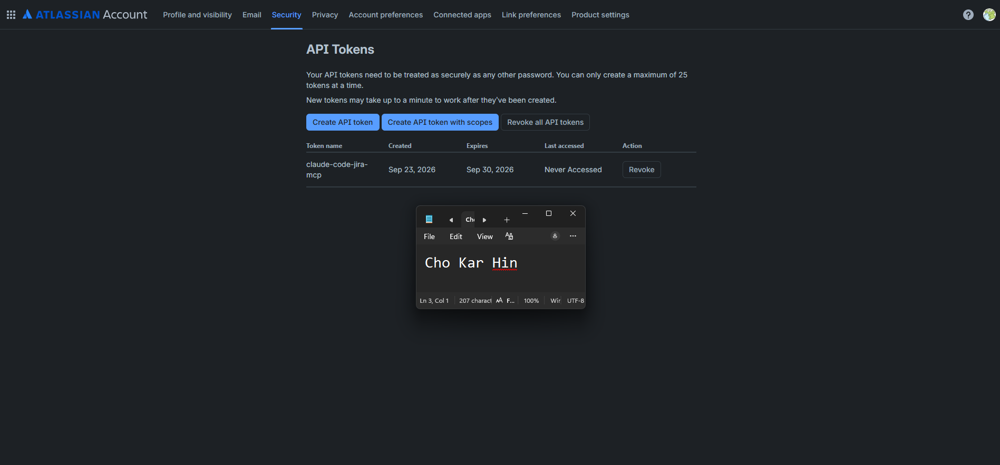
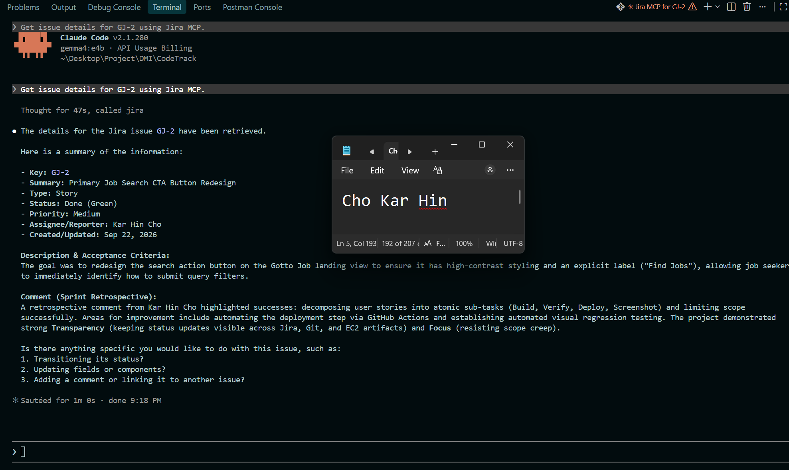

# Assignment 5 — AI-Assisted Sprint Health Report via Jira MCP

Part of the DevOps Micro Internship (DMI) Cohort 3 with Agentic AI

---

## Purpose

In this assignment, you will connect Claude Code to your Jira board through an MCP server, the same way you connected it to GitHub in Week 2, and build a read-only `/sprint-health` skill. The skill reads your current sprint through Jira's API and reports sprint velocity, stories at risk of missing the sprint, and items missing an estimate — but it must never create, edit, comment on, or transition a single ticket itself. You will prove that boundary holds by making a real change on the board yourself and confirming the skill only ever reports, never acts.

---

# Task 1 — Create a Jira API Token

## Goal

Generate an API token from your Atlassian account that the MCP server will use to authenticate with your Jira site. Do not screenshot the token value itself.

### Evidence

#### Screenshot 1 — Jira API token creation confirmation page showing the token name, with the token value not visible

### Notes You Must Write (Very Important):

Why does the MCP server need your site URL and account email in addition to the token?

Atlassian Cloud uses HTTP Basic Authentication for API calls. The site URL (e.g., [https://your-domain.atlassian.net](https://your-domain.atlassian.net)) defines the specific multitenant instance endpoint to route requests to. The account email acts as the identity principal (username), and the API token serves as the password secret. Without the specific site URL and email principal, the token cannot resolve which organization, workspace, or permissions context to authorize.

---

# Task 2 — Create .mcp.json at the Project Root

## Goal

Create or update `.mcp.json` at your project root with a Jira MCP server block, following the same shape as the GitHub MCP server you configured in Week 2.

### Evidence

#### Screenshot 2 — `.mcp.json` open in VS Code showing the Jira server configuration

### Notes You Must Write (Very Important):

Compare this jira block to the github block from Week 2 Assignment 5. The GitHub server ran via npx (a Node.js package); this one runs via uvx (a Python package) — what stays exactly the same shape despite that difference, and why doesn't Claude Code care which language a given MCP server is written in?

What stays identical is the MCP configuration schema: a top-level mcpServers object mapping a server identifier to a command, an args array, and an env dictionary. Claude Code is agnostic to the underlying runtime (Node.js via npx vs. Python via uvx) because MCP communicates over standardized JSON-RPC 2.0 via standard input and output (stdio). As long as the runtime can spawn an executable process and exchange JSON messages over standard streams, the host client communicates with both identically.

---

# Task 3 — Add Your Credentials to settings.local.json

## Goal

Add your Jira site URL, account email, and API token to `.claude/settings.local.json`, and confirm that file is listed in `.gitignore` so it is never committed.

### Evidence

#### Screenshot 3 — `settings.local.json` open in VS Code showing the `env` section, with the actual token value blurred or covered

### Notes You Must Write (Very Important):

Why must JIRA_API_TOKEN live in settings.local.json and never in .mcp.json?

.mcp.json is a repository configuration file intended to be tracked, committed, and pushed to version control so team members share tool definitions. Hardcoding JIRA_API_TOKEN inside .mcp.json would leak operational credentials to public or shared remotes. Storing it in .claude/settings.local.json—which is explicitly ignored in .gitignore—keeps credentials isolated on the local machine and injects them as runtime environment variables without risking security exposure.

---

# Task 4 — Verify the Connection with /mcp

## Goal

Restart Claude Code and confirm the Jira MCP server shows as connected.

### Evidence

#### Screenshot 4 — `/mcp` output showing `jira: connected`

---

# Task 5 — Run a Live Query to Prove Real Board Data

## Goal

Ask Claude to list the issues in your current active sprint through the Jira MCP connection, and confirm the result matches what you see on your live board in the browser.

### Evidence

#### Screenshot 5 — Claude's response showing the live sprint issue list retrieved via Jira MCP

### Notes You Must Write (Very Important):

How did you confirm this was real board data and not something Claude guessed?

I confirmed the response matched real board data by cross-referencing the returned issue keys (e.g., GJ-1, GJ-2), exact summary strings, assigned story point integers, and current workflow column statuses (Done, In Progress, To Do) with the live Jira board open in the browser. The data contained real timestamps, actual keys generated by Atlassian, and my specific user display name (Cho Kar Hin), which could not have been hallucinated by an LLM.

---

# Task 6 — Build the /sprint-health Skill

## Goal

Create a `/sprint-health` skill restricted to read-only Jira tools plus `Read`, with no issue-mutating tools and no `Write`. Run it and confirm it produces a report covering sprint velocity, at-risk stories, and items missing an estimate.

### Evidence

#### Screenshot 6 — `SKILL.md` frontmatter showing `allowed-tools` limited to read-only Jira tools plus `Read`, with `disable-model-invocation: true`

#### Screenshot 7 — `/sprint-health` output showing the full triage report against your real sprint

### Notes You Must Write (Very Important):

1. Which Jira MCP tools does this skill's allowed-tools list include, and which mutating tools (create issue, update issue, transition issue, add comment) does it deliberately exclude?

The skill's whitelist includes only read-only query tools: Read, mcp**jira**jira_search, mcp**jira**jira_get_issue, and mcp**jira**jira_get_all_projects. It deliberately excludes mutating tools such as mcp**jira**jira_create_issue, mcp**jira**jira_update_issue, mcp**jira**jira_transition_issue, and mcp**jira**jira_add_comment, as well as file modification tools like Write or Edit.

2. Why does a Scrum Master need this restriction more than almost any other role in this course?

A Scrum Master serves as a servant leader and process facilitator, not an autonomous task executor. If an AI agent acting as a Scrum Master could automatically transition tickets, alter story point estimates, or reassign work, it would fabricate velocity metrics, bypass team agreement, and invalidate the transparency of the Scrum Board. Restricting the tool to read-only guarantees that the AI reports objective reality without interfering with team ownership.

---

# Task 7 — Prove the Skill Never Mutates the Board

## Goal

Manually update one ticket on your board in the browser (for example, move a story to "Done" or add a missing estimate), then run `/sprint-health` again and confirm the new report reflects your change — proving the skill only ever reads live state and never wrote to the board itself.

### Evidence

#### Screenshot 8 — Second `/sprint-health` run showing the report now reflects your manual board change

### Notes You Must Write (Very Important):

Map this assignment to Gather → Analyze → Human Act → Verify from Week 3 Assignment 6. Which step did you perform manually in the browser, and why must that step stay human?

Gather: Claude Code queries Jira MCP (jira_search) to retrieve current ticket statuses, estimates, and assignees.
Analyze: The /sprint-health skill computes velocity metrics, identifies unestimated tickets, flags delivery risks, and outputs the health verdict.
Human Act: I manually transitioned the ticket on the Jira board in the browser.
Verify: Re-executing /sprint-health confirmed the updated metrics reflected my manual action.
The Human Act step must stay human because transitioning an issue or declaring work "Done" requires subjective validation against the team's Definition of Done (DoD). Delegating state-changing actions to an automated agent risks declaring defective or unverified code as complete without actual engineering verification.

---

# Submission Instructions

Complete all tasks in sequence.

Your submission must include:

- All 8 required screenshots
- All the required notes

---

# Completion Checklist

- [ ] Task 1: Jira API token created, value never screenshotted (Screenshot 1)
- [ ] Task 2: `.mcp.json` has the Jira server block (Screenshot 2)
- [ ] Task 3: Credentials stored in `settings.local.json`, token blurred, file gitignored (Screenshot 3)
- [ ] Task 4: `/mcp` shows the Jira server connected (Screenshot 4)
- [ ] Task 5: Live query returned real sprint data, verified against the browser (Screenshot 5)
- [ ] Task 6: `/sprint-health` skill created with correct read-only `allowed-tools`, and produced a full report (Screenshots 6–7)
- [ ] Task 7: A manual board change was reflected in a second `/sprint-health` run (Screenshot 8)
- [ ] Skill never created, edited, transitioned, or commented on any issue
- [ ] Reflection answered (Notes)
- [ ] No API token value exposed

---

## 📌 About DMI & CloudAdvisory

DevOps Micro Internship (DMI) is a project-based DevOps program run by Pravin Mishra (The CloudAdvisory) focused on real-world execution, systems thinking, and career readiness.

It helps learners build strong DevOps foundations with hands-on experience.

---

## 📌 Resources

- 🌐 DMI Official Website: https://dmi.pravinmishra.com?utm_source=github&utm_medium=readme
- 🎓 University: https://university.pravinmishra.com?utm_source=github&utm_medium=readme
- 💬 Discord Community: https://discord.pravinmishra.com?utm_source=github&utm_medium=readme
- 📝 Blog: https://dmi.pravinmishra.com/blog?utm_source=github&utm_medium=readme
- ▶️ YouTube Playlist: https://www.youtube.com/playlist?list=PLFeSNDtI4Cho
- 🔗 Pravin Mishra (LinkedIn): https://www.linkedin.com/in/pravin-mishra-aws-trainer/
- 🏢 CloudAdvisory (LinkedIn): https://www.linkedin.com/company/thecloudadvisory/

---

_This submission is part of DevOps Micro Internship (DMI) Cohort 3 — Agentic AI Track._
