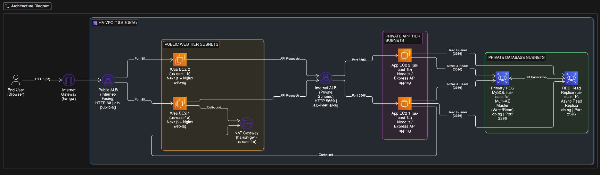
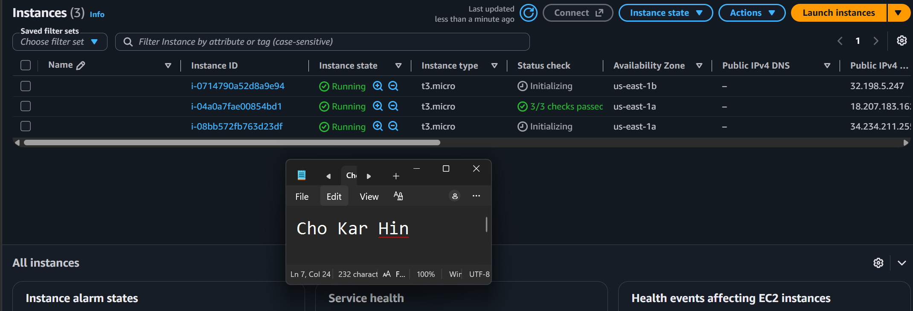
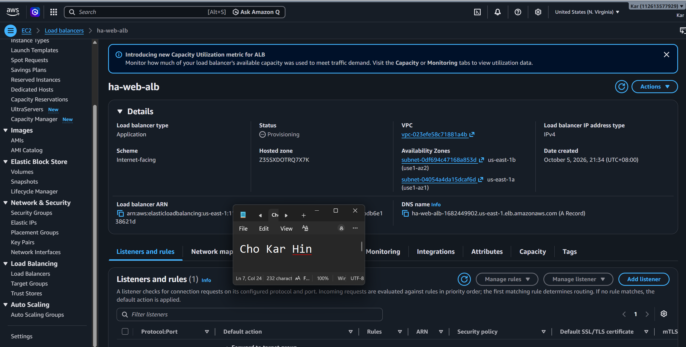
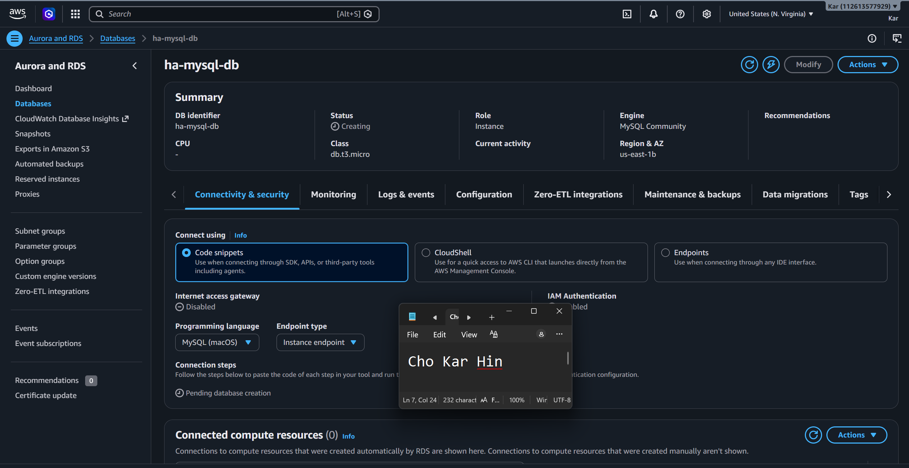
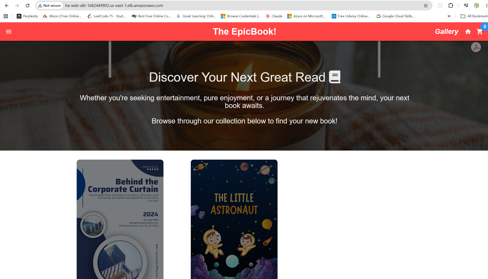
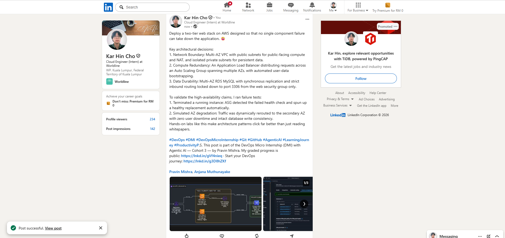

# Assignment 6 — Capstone Assignment — Deploy Book Review App (Three-Tier Architecture) on AWS

Part of the DevOps Micro Internship (DMI) Cohort 3 with Agentic AI

---

## Purpose

This is the most important assignment of the course. You will deploy the Book Review App in a fully production-style three-tier architecture on AWS: a Next.js Web Tier behind Nginx and a public ALB, a private Node.js/Express App Tier behind an internal ALB, and a private Multi-AZ MySQL RDS database with a read replica. You are expected to design, deploy, isolate, debug, and document the result independently.

---

# Task 1 — Architecture Diagram

## Goal

Create an architecture diagram showing the custom VPC (10.0.0.0/16), the six subnets across two Availability Zones (two public Web Tier, two private App Tier, two private Database Tier), the public ALB, Web Tier EC2/Nginx, internal ALB, private App Tier EC2, private Multi-AZ RDS with its read replica, and the permitted traffic flow.

### Evidence

#### Diagram image or link

---

# Task 2 — AWS Region & Services Used

## Goal

Record the AWS Region used and list every AWS service used across networking, compute, load balancing, security, and the database.

### Notes

**Region:**

us-east-1 (US East - N. Virginia)

---

**Services:**

Networking & Content Delivery: Amazon VPC, 6 Subnets (2 Public Web, 2 Private App, 2 Private DB across 2 AZs), Internet Gateway, NAT Gateway with Elastic IP, Route Tables.
Compute: Amazon EC2 (Next.js Web frontend and Node.js/Express backend instances).
Load Balancing: AWS Application Load Balancer (1 Internet-Facing ALB for public traffic, 1 Internal ALB for internal microservice API routing).Security & Identity: AWS Security Groups (least-privilege tier chaining: Public ALB $\rightarrow$ Web EC2 $\rightarrow$ Internal ALB $\rightarrow$ App EC2 $\rightarrow$ RDS), AWS IAM.
Database: Amazon RDS for MySQL (Multi-AZ Primary instance with an asynchronous cross-AZ Read Replica).
Management & Monitoring: Amazon CloudWatch, PM2 process manager, Nginx reverse proxy.

---

# Task 3 — Public Entry Point

## Goal

Confirm the Book Review App loads through the public ALB DNS name.

### Evidence

#### Public ALB DNS

Paste your public ALB DNS name here:

`https://ha-web-alb-1682449902-us-east-1.elb.amazonaws.com`

---

# Task 4 — Evidence Screenshots

## Goal

Capture visual proof of every tier and load balancer.

### Evidence

#### Web EC2

---

#### App EC2

---

#### Public ALB

---

#### Internal ALB

---

#### RDS + Replica

---

#### App UI proof

---

# Task 5 — Summary

## Goal

Summarize what worked in the final deployment, the issues encountered and how each was fixed, and the tools or sources used to research and debug.

### Notes

**What worked:**

Clean separation of concerns across 3 isolated tiers with two Availability Zones ensuring high availability.
The Internet-Facing ALB successfully accepted public user traffic and routed it to the Next.js frontend on the Web Tier.
The Internal ALB accepted backend API calls from the Web Tier and load-balanced them to the private Express App Tier.
Read/write splitting where transactional writes targeted the Primary Multi-AZ MySQL instance while query loads were directed to the Read Replica.

---

**Issues + fixes:**

Issue: Web Tier failed to connect to the Express API through the Internal ALB.
Fix: Updated alb-internal-sg inbound rules to explicitly allow port 5000 from the web-sg security group.
Issue: App tier instances in private subnets could not install npm dependencies during deployment.
Fix: Added route 0.0.0.0/0 pointing to the NAT Gateway in the private App Route Table to grant outbound internet access.
Issue: Database connection errors during initialization.
Fix: Configured db-sg inbound rules to authorize port 3306 exclusively from app-sg, keeping the database isolated from the public internet and Web Tier.

---

**Tools/sources used:**

Eraser.io for infrastructure architectural visualization.
AWS Management Console & AWS CLI for provisioning, subnet routing, and target health verification.
PM2 & Systemd for continuous Node.js background process management.
curl for step-by-step endpoint validation through each load balancer.

---

# LinkedIn Post (Required)

## Goal

Publish a LinkedIn post sharing the capstone deployment, including the public ALB DNS (or a redacted screenshot), three to five lines on what you built and why it is production-style, and one proof screenshot.

## Evidence

#### LinkedIn Post URL

Paste your LinkedIn post URL here:

`https://www.linkedin.com/posts/kar-hin-cho_devops-dmi-devopsmicrointernship-ugcPost-7512882293045125120-usfO/`

---

#### Screenshot of LinkedIn post

---

# Submission Instructions

- Add all required screenshots and links in your submission
- Do not expose passwords, RDS credentials, connection strings, private keys, or account IDs

---

# Completion Checklist

- [ ] Task 1: Architecture diagram completed
- [ ] Task 2: AWS Region and services documented
- [ ] Task 3: Public ALB DNS confirmed working
- [ ] Task 4: All six evidence screenshots captured (Web Tier, App Tier, both ALBs, RDS + replica, app UI)
- [ ] Task 5: Deployment summary completed (what worked, issues/fixes, tools/sources)
- [ ] LinkedIn post published and URL submitted
- [ ] App Tier and Database Tier confirmed not publicly accessible
- [ ] No sensitive data exposed

---

## 📌 About DMI & CloudAdvisory

DevOps Micro Internship (DMI) is a project-based DevOps program run by Pravin Mishra (The CloudAdvisory) focused on real-world execution, systems thinking, and career readiness.

It helps learners build strong DevOps foundations with hands-on experience.

---

## 📌 Resources

- 🌐 DMI Official Website: https://dmi.pravinmishra.com?utm_source=github&utm_medium=readme
- 🎓 University: https://university.pravinmishra.com?utm_source=github&utm_medium=readme
- 💬 Discord Community: https://discord.pravinmishra.com?utm_source=github&utm_medium=readme
- 📝 Blog: https://dmi.pravinmishra.com/blog?utm_source=github&utm_medium=readme
- ▶️ YouTube Playlist: https://www.youtube.com/playlist?list=PLFeSNDtI4Cho
- 🔗 Pravin Mishra (LinkedIn): https://www.linkedin.com/in/pravin-mishra-aws-trainer/
- 🏢 CloudAdvisory (LinkedIn): https://www.linkedin.com/company/thecloudadvisory/

---

_This submission is part of DevOps Micro Internship (DMI) Cohort 3 — Agentic AI Track._
