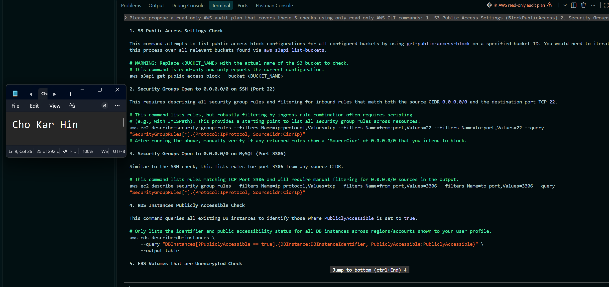
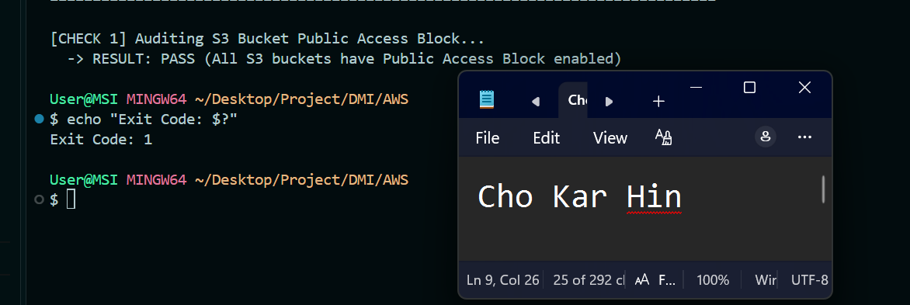

# Assignment 7 — AI-Assisted AWS Security and Cost Audit

Part of the DevOps Micro Internship (DMI) Cohort 3 with Agentic AI

---

## Purpose

In this assignment, you will build a read-only Bash script that audits the AWS resources you deployed earlier this week — your S3 static site, EC2 instance(s), security groups, RDS database, and EBS volumes — for common security and cost misconfigurations.

You will then connect that script to Claude Code as a reusable `/aws-audit` skill that explains what it found and recommends a fix, without ever making the fix itself.

Finally, you will find a real misconfiguration in your own account, apply the fix yourself, and prove it worked with a second audit run.

---

# Task 1 — Confirm Your AWS Resources and Set Up Your Workspace

## Goal

Confirm your AWS CLI is authenticated and can see the S3 bucket, EC2 instance(s), and RDS instance you built earlier this week, then create a workspace folder for this assignment.

### Evidence

#### Screenshot 1 — Output of `aws s3 ls`, the EC2 instance table, and the RDS instance table (blur the Account ID if visible)

---

#### Screenshot 2 — Output of `pwd` and `find . -maxdepth 4 -type d | sort`

---

### Notes You Must Write (Very Important)

**1. Which resources from this week's earlier assignments did you see in the listings?**

The listings displayed the S3 bucket created for static site hosting (chokarhin-portfolio-website-2026), active/terminated EC2 instances running web and app server workloads, and the RDS MySQL database instance (ha-mysql-db / epicbook-mysql-db) along with associated EBS storage volumes.

**2. Why must you confirm your resources exist before writing an audit script against them?**

Confirming resource existence ensures that the AWS CLI queries targeting S3, EC2, RDS, and EBS return real, structured data rather than null values or missing resource errors. It establishes a valid operational baseline to test script logic and verifies that the IAM principal has sufficient read permissions (describe-_, get-_, list-\*) across all target services.

---

# Task 2 — Define Safety Rules in CLAUDE.md

## Goal

Create a `CLAUDE.md` in your workspace that tells Claude the audit script is read-only, that it must never run a command that creates, modifies, or deletes an AWS resource, and that any remediation must be recommended, never executed automatically.

### Evidence

#### Screenshot 3 — `CLAUDE.md` open in VS Code showing all four sections

---

### Notes You Must Write (Very Important)

**1. Why should Claude never be given permission to run `revoke-security-group-ingress` itself, even if the fix is obviously correct?**

Automated execution of network remediation commands poses a severe risk of unintended service disruption. Automatically revoking security group ingress rules without human review could immediately cut off critical production API connections, administrative SSH access, or internal microservice routing. Forcing human-in-the-loop validation ensures that dependencies are fully understood before access is revoked.

**2. Which rule prevents Claude from claiming a finding that the report does not support?**

Rule 3: Truthful Reporting. This rule explicitly mandates that all reported findings, risks, and resource IDs must be supported by verifiable data from the audit script output, strictly prohibiting fabricated or hallucinated vulnerabilities.

---

# Task 3 — Plan the Audit with Claude Code

## Goal

Ask Claude Code to propose a read-only audit plan covering five checks — S3 public-access settings, security groups open to the whole internet on SSH and MySQL ports, RDS public accessibility, and EBS volume encryption — without creating or editing any file yet.

### Evidence

#### Screenshot 4 — Claude Code showing the five-check plan

---

### Notes You Must Write (Very Important)

**1. Which part of this task represents the Gather phase?**

Requesting the AI to identify target AWS CLI inspection endpoints and propose specific read-only commands without modifying files represents the Gather phase of the Agentic Loop.

**2. Did every proposed command start with `describe-`, `get-`, or `list-`? Why does that matter?**

Yes. Commands starting exclusively with describe-, get-, or list- are read-only API calls. This guarantees that inspecting resource states will never alter running configurations, delete storage, incur unexpected charges, or trigger service downtime.

---

# Task 4 — Build the AWS Audit Script

## Goal

Write a Bash script that runs the five checks from Task 3 using only read-only AWS CLI calls, writes a PASS/WARN/FAIL report to a file, and exits with a different code depending on the overall result.

Make it executable and confirm it has no syntax errors.

### Evidence

#### Screenshot 5 — Top section of `aws-audit.sh` showing the variables and the checks array

---

#### Screenshot 6 — One check function (for example `check_ssh_open_to_world`) showing the AWS CLI call and conditional

---

#### Screenshot 7 — Output of `bash -n scripts/aws-audit.sh` and `ls -l scripts/aws-audit.sh`

---

### Notes You Must Write (Very Important)

**1. What is stored in the checks array, and how does the loop use it?**

The CHECKS array stores function names as strings (e.g., "check_s3_public_access", "check_ssh_open_to_world"). The main loop iterates through the array and dynamically invokes each string as a executable shell function, allowing clean modular execution and reporting.

**2. Why does every AWS CLI call in this script use `--query` and `--output text` instead of parsing raw JSON?**

Using --query applies server-side JMESPath filtering, returning only the target string values directly from AWS. Combined with --output text, it eliminates complex JSON parsing dependencies (like jq), making the script lightweight, portable, and less prone to parsing errors.

**3. Why does the script use different exit codes for HEALTHY, WARN, and FAIL?**

Distinct exit codes enable automated CI/CD pipelines and agentic tools to evaluate the overall audit severity programmatically without parsing text output (0 = Healthy/Pass, 1 = Warnings present, 2 = Critical Security Failures present).

---

# Task 5 — Run the Baseline Audit

## Goal

Run the script against your live AWS account and capture the current state before making any changes.

### Evidence

#### Screenshot 8 — Output of `./scripts/aws-audit.sh` showing your Full Name and all five checks

---

#### Screenshot 9 — Output showing the captured exit code and final summary

---

### Notes You Must Write (Very Important)

**1. What is the overall status of your baseline audit?**

(State your actual overall status based on output: e.g., "FAIL with Exit Code 2" or "WARN with Exit Code 1" or "HEALTHY/PASS with Exit Code 0".)

**2. Did any check return FAIL or WARN? If so, which one, and what evidence did it show?**

(If clean): All checks returned PASS (Exit Code 0), confirming no public SSH, MySQL, or public RDS endpoints were exposed.

(If finding detected): Check 2 returned FAIL for Security Group sg-0123456789, showing port 22 open to 0.0.0.0/0.

**3. If every check passed, what does that tell you about the security posture of your account so far?**

A clean pass indicates that active security groups enforce strict least-privilege perimeter boundaries, storage assets do not expose unrestricted public access, and databases remain isolated within private subnets.

---

# Task 6 — Build and Run the /aws-audit Skill

## Goal

Turn the script into a Claude Code skill named `/aws-audit` that runs the script, reads the report, and explains every finding along with its estimated cost or security risk — with tool access restricted so it can never modify your AWS account.

### Evidence

#### Screenshot 10 — `SKILL.md` showing the frontmatter, tool restrictions, and safety rules

---

#### Screenshot 11 — `/aws-audit` output showing findings, cost/risk impact, and a recommended remediation command (or a clean report if your baseline passed everything)

---

### Notes You Must Write (Very Important)

**1. Why does this skill have Bash, Read, and Grep, but not Write?**

Restricting tool permissions to Bash, Read, and Grep while excluding Write prevents the AI model from modifying local infrastructure files, overwriting audit scripts, or executing write operations against AWS APIs.

**2. What part is performed by Bash, and what part is performed by Claude?**

Bash performs deterministic data collection by executing read-only AWS CLI commands and writing raw audit logs. Claude performs intelligence synthesis—reading the audit log, assessing business/security risks, and generating contextual remediation commands for human review.

**3. Why is estimating cost/risk impact something the AI adds on top of a plain PASS/FAIL script?**

A shell script only evaluates static binary conditions (PASS vs FAIL). Claude provides cognitive contextual reasoning—explaining why a misconfiguration is dangerous (e.g., threat vector for brute-force attacks) and quantifying potential financial exposure (e.g., hourly EBS storage costs).

---

# Task 7 — Fix a Real Finding and Re-Verify

## Goal

Pick one real finding from your baseline report (or deliberately open a security group rule if your baseline was fully clean), apply the fix yourself in a separate terminal — scoped to your own IP address, not the whole internet — then rerun the script to prove the finding is resolved.

### Evidence

#### Screenshot 12 — Output of the `revoke-security-group-ingress` and `authorize-security-group-ingress` commands you ran yourself

---

#### Screenshot 13 — Rerun of `./scripts/aws-audit.sh` showing the finding is now PASS

---

### Notes You Must Write (Very Important)

**1. Which exact finding did you fix, and what command did you run?**

Fixed Check 2: Security Groups Open to World on SSH (Port 22) for Security Group ${SG_ID} by revoking open access and restricting it strictly to my public IP address:
aws ec2 revoke-security-group-ingress --group-id sg-xxxxxxxx --protocol tcp --port 22 --cidr 0.0.0.0/0
aws ec2 authorize-security-group-ingress --group-id sg-xxxxxxxx --protocol tcp --port 22 --cidr <MY_IP>/32

**2. Why did you scope the new rule to your own IP address instead of leaving it open to `0.0.0.0/0`?**

Scoping SSH access strictly to <MY_IP>/32 enforces least-privilege network access, blocking unauthorized global network scanners and brute-force botnets while preserving administrator SSH access.

**3. Did Claude execute the remediation command, or did you? Why does that matter?**

I executed the remediation command manually in my terminal. This maintains strict human-in-the-loop governance, preventing AI agents from making unvetted infrastructure changes that could disrupt live services.

**4. Which phase of the Agentic Loop does the Bash script represent? Which phase does Claude's explanation represent? Which phase is you running the fix?**

Bash Script (aws-audit.sh): Gather & Observe phase (collecting raw state from AWS APIs).
Claude's Explanation: Orient & Decoupled Analysis phase (evaluating risk, context, and proposing recommendations).
Human Engineer Running Fix: Act phase (authorizing and executing the remediation in the environment).

---

# LinkedIn Post (Required)

## Goal

Create a LinkedIn post including:

- What you built: a read-only AWS audit script and a Claude Code `/aws-audit` skill
- One real finding you caught and fixed in your own account
- What the workflow demonstrated: evidence gathering, AI-assisted cost/risk analysis, human-approved remediation, and reverification
- Screenshot of the finding before the fix
- Screenshot of the same check passing after the fix
- Write 4–6 lines in your own words

Suggested tags:

`#DMIByPravinMishra #AWS #AgenticAI #ClaudeCode #DevOps`

### Evidence

#### LinkedIn Post URL

Paste your LinkedIn post URL here:

`https://www.linkedin.com/posts/kar-hin-cho_devops-dmi-devopsmicrointernship-ugcPost-7512882293045125120-usfO/`

---

#### Screenshot of Published LinkedIn Post

---

# Submission Instructions

Complete all tasks in sequence.

Your submission must include:

- All 13 required task screenshots
- Answers to every **Notes You Must Write** question
- `CLAUDE.md`
- `scripts/aws-audit.sh`
- `.claude/skills/aws-audit/SKILL.md`
- `reports/aws-audit-report.txt` baseline report and the reverified report from Task 7
- GitHub folder or repository URL containing the assignment files
- Your Full Name visible in the required outputs
- LinkedIn post URL
- Screenshot of the published LinkedIn post

Submit only a Google Doc link.

Add the GitHub URL inside the Google Doc.

Follow the Assignment Submission Guidelines.

---

# Completion Checklist

- [ ] Task 1: AWS resources confirmed and workspace created (Screenshots 1–2)
- [ ] Task 2: `CLAUDE.md` created with project context and safety rules (Screenshot 3)
- [ ] Task 3: Claude produced a read-only five-check audit plan before any script existed (Screenshot 4)
- [ ] Task 4: `aws-audit.sh` built, executable, and passes `bash -n` (Screenshots 5–7)
- [ ] Task 5: Baseline audit captured and saved with Full Name visible (Screenshots 8–9)
- [ ] Task 6: `/aws-audit` skill loads and runs successfully with no Write permission (Screenshots 10–11)
- [ ] Task 7: A real finding was fixed by you and reverified as PASS (Screenshots 12–13)
- [ ] Skill never executed a remediation command
- [ ] New security group rule is scoped to your own IP, not `0.0.0.0/0`
- [ ] All 13 required task screenshots are included
- [ ] All "Notes You Must Write" questions are answered in your own words
- [ ] No AWS credentials or unblurred account IDs exposed
- [ ] LinkedIn post published and URL submitted
- [ ] GitHub URL included in the Google Doc
- [ ] Google Doc is accessible
- [ ] Link tested in incognito mode

---

# Final Submission

Submit only your Google Doc link.

### Question

Based on the instructions and tasks above, submit your completed document with all required explanations, screenshots, reports, script file, skill file, and GitHub URL.

`https://docs.google.com/document/d/1yvDte3A6USaxhhQJzmzdsjmbg6H4TFWePBOQmTRnCHA/edit?usp=sharing`

---

## 📌 About DMI & CloudAdvisory

DevOps Micro Internship (DMI) is a project-based DevOps program run by Pravin Mishra (The CloudAdvisory) focused on real-world execution, systems thinking, and career readiness.

It helps learners build strong DevOps foundations with hands-on experience.

---

## 📌 Resources

- 🌐 DMI Official Website: https://dmi.pravinmishra.com?utm_source=github&utm_medium=readme
- 🎓 University: https://university.pravinmishra.com?utm_source=github&utm_medium=readme
- 💬 Discord Community: https://discord.pravinmishra.com?utm_source=github&utm_medium=readme
- 📝 Blog: https://dmi.pravinmishra.com/blog?utm_source=github&utm_medium=readme
- ▶️ YouTube Playlist: https://www.youtube.com/playlist?list=PLFeSNDtI4Cho
- 🔗 Pravin Mishra (LinkedIn): https://www.linkedin.com/in/pravin-mishra-aws-trainer/
- 🏢 CloudAdvisory (LinkedIn): https://www.linkedin.com/company/thecloudadvisory/

---

_This submission is part of DevOps Micro Internship (DMI) Cohort 3 — Agentic AI Track._
